# QubitGuard: Automated Testing, Fault Localization, and Repair Framework for Quantum Programs

[](https://github.com/sudiptob1/QubitGuard/actions/workflows/ci.yml)
[](https://www.python.org/downloads/)
[](https://opensource.org/licenses/Apache-2.0)
[](https://qiskit.org/)

**QubitGuard** is an open-source, research-grade Quantum Software Engineering (QSE) platform designed for automated fault injection, metamorphic and property-based testing, quantum spectrum-based fault localization (Q-SBFL), and automated program repair (Q-APR).

Developed as an academic research artifact, QubitGuard addresses the fundamental challenges of quantum software assurance: the **quantum test oracle problem**, **measurement collapse**, and **environmental decoherence confounding**.

---

## 🌟 Key Features

* **Quantum Benchmark Suite**: Standard reference circuits covering maximum entanglement (Bell, GHZ-3q/4q), quantum communication (Teleportation-3q), structured search (Grover-2q), phase estimation (QFT-3q), and variational optimization (QAOA MaxCut-3q).
* **Reproducible Quantum Fault Injection**: 8 standardized quantum gate mutation operators (`GATE_OMISSION`, `WRONG_GATE`, `WRONG_QUBIT`, `PARAMETER_PERTURBATION`, `GATE_ORDER_SWAP`, `MEASUREMENT_MUTATION`, `CONTROLLED_OPERATION`, `REDUNDANT_GATE`) with deterministic seeds and AST diffs.
* **Multi-Strategy Testing & Statistical Detection**: Metamorphic relations (Unitary Inverse $U U^\dagger = I$, Qubit Permutation Equivariance) and property invariants evaluated through Total Variation Distance (TVD) and Pearson's $\chi^2$ hypothesis testing.
* **Physical Decoherence Simulation**: Parameterized Qiskit Aer noise models including depolarizing channels ($\epsilon \in [0.00, 0.05]$), Pauli bit/phase-flip, and measurement readout errors.
* **Quantum Spectrum-Based Fault Localization (Q-SBFL)**: Ochiai, Tarantula, and DStar ($D^*$) suspicion ranking augmented by differential sub-circuit slicing.
* **Automated Program Repair (Q-APR)**: Heuristic mutation search guided by localization rankings with dual-tier validation (test-adequacy + holdout distribution fidelity).
* **Interactive Streamlit Dashboard**: Web UI for interactive circuit inspection, fault injection, noise sweeps, SBFL suspicion heatmaps, and repair candidate validation.
* **Full Empirical Reproducibility**: 100% deterministic experiment runner script answering five formal research questions (RQ1–RQ5).

---

## 🏗️ Architecture Overview

```mermaid
flowchart LR
    A[Quantum Program] --> B[Static Analysis & Metadata]
    B --> C[Fault Injection Engine]
    C --> D[Metamorphic & Property Test Generator]
    D --> E[Aer Simulator Ideal / Noisy]
    E --> F[Statistical Fault Detector]
    F --> G[Quantum SBFL Localizer]
    G --> H[Candidate Patch Generator]
    H --> I[Patch Validation & Ranking]
    I --> J[Quality & Reliability Report]
```



---

## 📊 Summary of Empirical Research Results

Evaluation conducted across **200 circuit executions** over 6 benchmark families under depolarizing error rates $\epsilon \in \{0.00, 0.01, 0.02, 0.05\}$:

| Metric | Result | Interpretation |
|---|---|---|
| **Overall Mutation Score (Recall)** | **73.30%** | Detected 129 out of 176 injected mutants across all circuits and noise levels. |
| **Precision** | **98.47%** | Near-zero false alarm rate on clean circuits due to noise-calibrated thresholds. |
| **F1-Score** | **0.8404** | High balance between error sensitivity and noise robustness. |
| **Hardest Fault Class (RQ2)** | **PARAMETER_PERTURBATION** (50%) | Small rotation angle drifts closely resemble shot noise. |
| **Easiest Fault Class (RQ2)** | **CONTROLLED_OPERATION** (87.5%) | Accidental entangling gates trigger massive distribution divergence. |
| **Q-SBFL Top-3 Accuracy (RQ4)** | **69.70%** | Actual faulty gate isolated within the top 3 suspicious gates in ~70% of runs. |
| **Q-SBFL Mean Exam Score (RQ4)**| **31.79%** | Debuggers inspect < 32% of total gates before finding the exact defect. |
| **Automated Repair Success (RQ5)** | **50.00%** | Synthesized validated semantic patches in 16.1s average search time. |

*Full data available in [`experiments/outputs/benchmark_summary.json`](experiments/outputs/benchmark_summary.json) and detailed discussion in [`docs/research_report.md`](docs/research_report.md).*

---

## 🚀 Quick Start

### 1. Installation
```bash
# Clone the repository
git clone https://github.com/sudiptob1/QubitGuard.git
cd QubitGuard

# Create virtual environment
python3 -m venv .venv
source .venv/bin/activate

# Install dependencies and package
pip install --no-build-isolation -e .
```

### 2. Run Test Suite
```bash
pytest -v tests/
```

### 3. Launch the Interactive Dashboard
```bash
streamlit run app/app.py
```
Open `http://localhost:8501` to use the interactive research dashboard.

### 4. CLI Usage Examples
```bash
# List all available benchmark circuits
qubitguard benchmarks

# Inject a fault into Bell State
qubitguard inject --circuit Bell_State --fault GATE_OMISSION --seed 42

# Execute test suite under 2% depolarizing noise
qubitguard test --circuit GHZ_3q --noise 0.02

# Run automated repair
qubitguard repair --circuit Bell_State --fault GATE_OMISSION --seed 42
```

### 5. Reproducing All Research Experiments
```bash
# Run full benchmark evaluation suite
python experiments/scripts/run_benchmark.py

# Generate Plotly scientific figures
python experiments/scripts/generate_figures.py
```

---

## 📚 Documentation Hierarchy

* [`docs/literature_review.md`](docs/literature_review.md): Survey of quantum software testing, mutation analysis, SBFL, and APR.
* [`docs/research_questions.md`](docs/research_questions.md): Formal formulation of RQ1–RQ5.
* [`docs/architecture.md`](docs/architecture.md): Deep-dive into subsystem design and classes.
* [`docs/fault-models.md`](docs/fault-models.md): Mathematical definition of 8 quantum mutation operators.
* [`docs/testing-methodology.md`](docs/testing-methodology.md): Metamorphic relations and statistical divergence assertions.
* [`docs/noise-models.md`](docs/noise-models.md): Noise modeling via Kraus maps and Pauli channels.
* [`docs/localization.md`](docs/localization.md): SBFL formulas (Ochiai, Tarantula, DStar) and differential slicing.
* [`docs/repair.md`](docs/repair.md): Quantum program repair, mutation search, and validation.
* [`docs/experiments.md`](docs/experiments.md): Experimental setup and parameter matrices.
* [`docs/reproducibility.md`](docs/reproducibility.md): Step-by-step reproduction instructions.
* [`docs/research_report.md`](docs/research_report.md): Complete research report with empirical findings.
* [`docs/limitations.md`](docs/limitations.md): Threats to validity and known technical constraints.
* [`paper/main.tex`](paper/main.tex): Academic preprint manuscript in IEEEtran format.

---

## 📜 Citation
If you use QubitGuard in academic work, please cite:
```bibtex
@software{biswas2026qubitguard,
  author = {Biswas, Sudipto},
  title  = {QubitGuard: Automated Testing, Fault Localization, and Repair Framework for Quantum Programs},
  year   = {2026},
  url    = {https://github.com/sudiptob1/QubitGuard}
}
```

---

## 📄 License
This project is licensed under the [Apache 2.0 License](LICENSE).
