# QubitGuard System Architecture & Design Specification

## 1. High-Level Architectural Pipeline
The QubitGuard pipeline operates sequentially as an end-to-end automated testing, localization, and repair loop:

```mermaid
flowchart LR
    A[Quantum Program] --> B[Static Analysis & Metadata]
    B --> C[Fault Injection Engine]
    C --> D[Metamorphic & Property Test Generator]
    D --> E[Aer Simulator Ideal / Noisy]
    E --> F[Statistical Fault Detector]
    F --> G[Quantum SBFL Localizer]
    G --> H[Candidate Patch Generator]
    H --> I[Patch Validation & Ranking]
    I --> J[Quality & Reliability Report]
```

---

## 2. Component Specifications

### 2.1 Core Module (`qubitguard.core`)
- **`CircuitProgram`**: Encapsulates `qiskit.QuantumCircuit` alongside architectural properties (depth, gate counts, entanglement structure, ideal basis distributions).
- **`GateMetadata`**: Granular tracking of gate index, operator type, affected qubits/clbits, continuous parameters ($\theta, \phi, \lambda$), and control attributes.

### 2.2 Benchmark Library (`qubitguard.benchmarks`)
Standardized evaluation circuits with known theoretical properties:
1. **Bell State ($|\Phi^+\rangle$)**: 2-qubit maximum entanglement.
2. **GHZ State (3q, 4q)**: Multi-party Greenberger-Horne-Zeilinger entanglement.
3. **Quantum Teleportation (3q)**: Bell pair distribution and classical feed-forward correction.
4. **Grover Search (2q)**: Amplitude amplification with marked target state.
5. **Quantum Fourier Transform (3q)**: Quantum phase estimation core routine.
6. **QAOA MaxCut Ansatz (3q)**: Variational quantum eigensolver layer with continuous parameterization.

### 2.3 Fault Injection Engine (`qubitguard.fault_injection`)
Supports 8 mutation operators with reproducible random seeds:
- `GATE_OMISSION`: Deletion of unitary operations.
- `WRONG_GATE`: Substitution within compatible arity (e.g. $H \leftrightarrow X$, $CX \leftrightarrow CZ$).
- `WRONG_QUBIT`: Control/target wire redirection.
- `PARAMETER_PERTURBATION`: Continuous rotation angle perturbation ($\delta \in [0.1\pi, 0.5\pi]$).
- `GATE_ORDER_SWAP`: Commutation violation between adjacent gates.
- `MEASUREMENT_MUTATION`: Redirecting measurement taps.
- `CONTROLLED_OPERATION`: Converting single-qubit unitaries to entangling 2-qubit operations.
- `REDUNDANT_GATE`: Unintended extra gate insertion.

### 2.4 Noise Simulation (`qubitguard.noise`)
Configurable `qiskit_aer.noise.NoiseModel`:
- Depolarizing channel: parameterized error rates $\epsilon \in [0.00, 0.08]$.
- Pauli bit-flip and phase-flip errors.
- Readout measurement assignment errors.
- Comprehensive composite NISQ models.

### 2.5 Testing & Detection (`qubitguard.test_generation`, `qubitguard.detection`)
- **Metamorphic Relations (MRs)**:
  - *MR1 (Inverse Identity)*: Appending $U^\dagger$ to non-measurement block must restore $|0\dots 0\rangle$.
  - *MR2 (Qubit Permutation)*: Symmetry in physical qubit swapping matches output permutation.
- **Statistical Divergence Measures**:
  - Total Variation Distance: $\text{TVD}(P, Q) = \frac{1}{2} \sum_x |P(x) - Q(x)|$.
  - Jensen-Shannon Divergence ($D_{JS}$).
  - Pearson's $\chi^2$ significance hypothesis testing.

### 2.6 Spectrum-Based Fault Localization (`qubitguard.localization`)
- Combines classical SBFL spectrum formulations (Ochiai, Tarantula, DStar) with sub-circuit differential slicing to produce gate suspicion rankings $S(g) \in [0, 1]$.

### 2.7 Automated Program Repair (`qubitguard.repair`)
- Search space: Insertion, deletion, replacement, and parameter re-tuning directed at suspicious gate indices.
- Dual-tier validation: Checks both test-suite pass rate and holdout state fidelity to avoid test overfitting.
